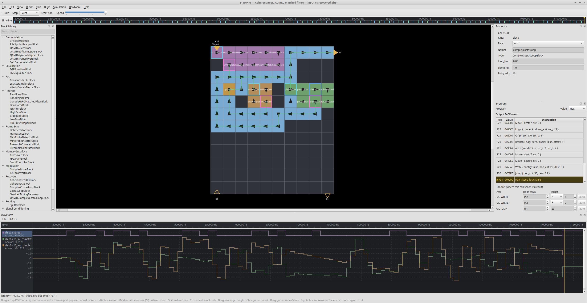

<!--
SPDX-License-Identifier: GPL-3.0-or-later
Copyright (c) Lattrex. placeKYT and the Kyttar name and logo are trademarks of
Lattrex; see CONTRIBUTING.md for the brand-usage note.
-->

<p align="center"></p>

# placeKYT

**The place-and-route + simulation IDE for the Kyttar asynchronous cell array.**

> **Say it:** *Kyttar* is **guitar** with a "k" — *KIT-tar*. The **KYT** in
> *placeKYT* is pronounced like **kit**.

placeKYT is a visual design environment for the Kyttar processor — a 2-D grid of
identical, clockless compute cells that pass data to their neighbours like
nutrients through a network. You place DSP blocks on the array, route the
connections, build a bitstream, and run it on the bundled **simKYT** simulator —
watching data flow through the fabric cell-by-cell with a live transaction log,
waveform viewer, and cell inspector. A GNU Radio integration lets you drive a
placeKYT-hosted chip from a flowgraph for stimulus and measurement.

> Kyttar is a massively-parallel, asynchronous architecture aimed at real-time
> software-defined radio: place a chain of DSP blocks, and the array runs them in
> parallel with no global clock.

<p align="center"></p>

<p align="center"><sub>A BPSK receiver in placeKYT — the block library (left), the design placed and routed on the cell array (center), the per-cell program view (right), and the live waveform output (bottom).</sub></p>

---

## What's in this repository

| Path | What it is |
|------|------------|
| `placekyt/` | The placeKYT IDE — Qt GUI, headless CLI, place/route/build engine, and the data model. |
| `gr-kyttar/` | A GNU Radio out-of-tree module: source/sink blocks that stream data to a placeKYT-hosted chip, plus runnable example flowgraphs. |
| `runtime/` | The simKYT runtime: the `gr_kyttar` block-build library (placement + bitstream generation) and the prebuilt `simkyt` simulator extension. |

---

## Quick look

- **Place & route** DSP blocks on the cell array — by hand on the canvas, or
  auto-placed and auto-routed.
- **Build** a Kyttar bitstream from your design.
- **Simulate** it on simKYT and watch it run: per-cell execution, a transaction
  log, a digital waveform viewer with cursors, a timeline scrubber, and
  breakpoints.
- **Import a GNU Radio flowgraph** of Kyttar DSP blocks and turn it into a placed
  design.
- **Drive it from GNU Radio**: host a chip in placeKYT and connect a flowgraph to
  it over a local socket for stimulus generation and waveform measurement —
  without hand-translating your design into a flowgraph.
- **Stay in sync with GNU Radio**: when a block parameter changes in the connected
  flowgraph (e.g. a FIR going 7→40 taps), placeKYT detects the drift and shows an
  "out of sync — click to resync" indicator. Resync re-applies the GRC parameters
  and — because a parameter change can resize a block — re-places and re-routes the
  affected blocks. Choose the policy in **Edit → Preferences** (*Notify only*,
  *Auto place & route*, or *Re-anchor only*).

---

## Getting started

placeKYT installs from source today (Linux + Python 3.12; other platforms and
one-file installers are on the roadmap — see **[INSTALL.md](INSTALL.md)**).

> **Tested on Ubuntu 24.04 LTS.** Other Linux distributions should work with
> minor tweaks (mainly the package-manager names in step 1 of
> [INSTALL.md](INSTALL.md)). The `simkyt` simulator ships as a prebuilt
> **Linux · x86-64 · CPython 3.12** extension; other platforms/Python versions
> are on the roadmap (see [INSTALL.md](INSTALL.md)).

```bash
# 1. clone
git clone https://github.com/Lattrex/placekyt.git
cd placekyt

# 2. install (see INSTALL.md for the full, platform-specific steps)
python3 -m venv .venv
.venv/bin/pip install -r placekyt/requirements-dev.txt
.venv/bin/pip install -e runtime/python      # gr_kyttar + the prebuilt simkyt extension

# 3. launch the GUI
.venv/bin/python placekyt/main.py
```

Then start with the simplest demo, [`examples/gain/`](examples/gain/) — a single
gain block, the best place to learn the placeKYT UI and the GNU Radio ↔ placeKYT
workflow end to end. From there, [`examples/coherent_bpsk_rx/`](examples/coherent_bpsk_rx/)
shows the same flow on a full coherent BPSK receiver, and the
[**`examples/`**](examples/) directory has the complete set —
BPSK/QPSK/4FSK/16-QAM modems, AM/FM/SSB/CW/PSK31 transceivers, a data link,
audio effects, and more — each with its own README. See
[`INSTALL.md`](INSTALL.md) for the complete GNU Radio + demo walkthrough.

To build a design headlessly and check it against a golden output:

```bash
.venv/bin/python placekyt/cli.py --test examples/gain/gain.kyt \
    --chip-type placekyt/resources/chips/kyttar_10x12.yaml
# -> test PASSED: 12 output words match
```

---

## Documentation

- **[INSTALL.md](INSTALL.md)** — install from source (now) and the packaged-installer roadmap (Windows `.exe`/`.msi`, Linux `.AppImage`/`.deb`/`.rpm`, macOS `.app`).
- **[PROGRAMMING_GUIDE.md](PROGRAMMING_GUIDE.md)** — the Kyttar programming model: the instruction set, memory map, configuration registers, Q15 fixed-point, and how DSP blocks are written and placed. This is what you need to read a simulation.
- **[BLOCK_AUTHORING_GUIDE.md](BLOCK_AUTHORING_GUIDE.md)** — a step-by-step guide to writing your **own** DSP block (single-cell, multi-cell, feedback) and exposing it in GNU Radio Companion. Start here once you want to go beyond the bundled blocks.
- **[AGENTS.md](AGENTS.md)** — the front door for an **automated agent**: the default mission (build and verify the next block in `verification/manifest.json`), the per-block loop, and the definition of done. Tool-neutral.
- **[CONTRIBUTING.md](CONTRIBUTING.md)** — how to contribute, run the tests, and a note on the simKYT simulator and Lattrex branding.
- **[examples/README.md](examples/README.md)** — an index of all the bundled demos: the complete set — BPSK/QPSK/4FSK/16-QAM modems, AM/FM/SSB/CW/PSK31 transceivers, a data link, audio effects, and more — each with its own walkthrough.

---

## Block library & verification

Every Kyttar DSP block is verified to be a **drop-in equivalent of its GNU Radio
Companion counterpart** — **the same name, the same parameters**, output matching
within fixed-point quantization noise. GNU Radio is the golden reference; the
Kyttar block runs on simKYT as the device under test. Each block's exact GNU Radio
factory is named in the dashboard so you never have to guess the equivalent.

<!-- BLOCK-STATUS:BEGIN (generated by verification/tools/gen_dashboard.py) -->
**Block library: 122 verified · 0 in progress · 122 targeted.** Full table → [`verification/STATUS.md`](verification/STATUS.md).

| Verified block | GNU Radio equivalent | Quality (vs GNU Radio) |
|----------------|----------------------|-------------------|
| **GainBlock** | `blocks.multiply_const_ff` | err 1 / tol 2 LSB · -90 dB SNR |
| **ComplexGainBlock** | `blocks.multiply_const_cc` | err 4 / tol 7 LSB · -84 dB SNR |
| **UpsamplerBlock** | `filter.interp_fir_filter_fff` | err 0 / tol 0 LSB |
| **RepeatBlock** | `blocks.repeat` | err 0 / tol 0 LSB |
| **ComplexUpsamplerBlock** | `filter.interp_fir_filter_ccc` | err 0 / tol 0 LSB |
| **IQUpconvertBlock** | `blocks.multiply_cc` | err 1 / tol 6 LSB · -85 dB SNR |
| **RRCPulseShaperBlock** | `filter.firdes.root_raised_cosine` | err 4 / tol 34 LSB · -66 dB SNR |
| **MultiplyBlock** | `blocks.multiply_ff` | err 1 / tol 2 LSB · -92 dB SNR |
| **AddBlock** | `blocks.add_ff` | err 1 / tol 2 LSB · -90 dB SNR |
| **SubtractBlock** | `blocks.sub_ff` | err 1 / tol 2 LSB · -89 dB SNR |
| **XorBlock** | `blocks.xor_bb` | err 0 / tol 0 LSB |
| **ComplexToFloatBlock** | `blocks.complex_to_float` | err 0 / tol 0 LSB |
| **FloatToComplexBlock** | `blocks.float_to_complex` | err 0 / tol 0 LSB |
| **FloatToCharBlock** | `blocks.float_to_char` | BER 0 (32 bits) |
| **ComplexToMagSquaredBlock** | `blocks.complex_to_mag_squared` | err 2 / tol 3 LSB · -83 dB SNR |
| **ConjugateBlock** | `blocks.conjugate_cc` | err 0 / tol 0 LSB |
| **AbsBlock** | `blocks.abs_ff` | err 0 / tol 2 LSB |
| **StreamSplitterBlock** | `blocks.copy` | err 0 / tol 0 LSB |
| **AndConstBlock** | `blocks.and_const_bb` | err 0 / tol 0 LSB |
| **KeepOneInNBlock** | `blocks.keep_one_in_n` | err 0 / tol 0 LSB |
| **DelayBlock** | `blocks.delay` | err 0 / tol 0 LSB |
| **MovingAverageBlock** | `blocks.moving_average_ff` | err 2 / tol 5 LSB · -72 dB SNR |
| **ComplexToRealBlock** | `blocks.complex_to_real` | err 0 / tol 0 LSB |
| **ComplexToImagBlock** | `blocks.complex_to_imag` | err 0 / tol 0 LSB |
| **DCBlockerBlock** | `filter.dc_blocker_ff` | err 34 / tol 59 LSB · -51 dB SNR |
| **FIRFilterBlock** | `filter.fir_filter_fff` | err 11 / tol 17 LSB · -65 dB SNR |
| **IIRBiquadBlock** | `filter.iir_filter_ffd` | err 16 / tol 21 LSB · -64 dB SNR |
| **ComplexMixerBlock** | `blocks.multiply_cc + analog.sig_source` | err 5 / tol 12 LSB · -74 dB SNR |
| **NCOBlock** | `analog.sig_source_c` | err 9 / tol 12 LSB · -72 dB SNR |
| **SoftDemodulatorBlock** | `digital.constellation_soft_decoder_cf` | err 1 / tol 2 LSB |
| **ComplexRRCMatchedFilterBlock** | `filter.fir_filter_ccf (rrc taps)` | err 11 / tol 18 LSB · -54 dB SNR |
| **AGCBlock** | `analog.agc_ff` | err 3 / tol 80 LSB · -81 dB SNR |
| **ComplexCostasLoopBlock** | `digital.costas_loop_cc` | BER 0 |
| **GardnerTimingRecovery** | `digital.symbol_sync_cc` | pass |
| **MMTimingRecoveryBlock** | `digital.symbol_sync_cc` | pass |
| **BPSKSlicerBlock** | `digital.binary_slicer_fb` | BER 0 (10 bits) |
| **SquelchBlock** | `analog.pwr_squelch_ff` | err 0 / tol 4 LSB |
| **PSKSymbolMapperBlock** | `digital.chunks_to_symbols` | err 0 / tol 0 LSB |
| **MapBBBlock** | `digital.map_bb` | BER 0 (40 bits) |
| **FSK4SymbolMapperBlock** | `digital.chunks_to_symbols_bf (4FSK level table)` | err 0 / tol 0 LSB |
| **FSK4SlicerBlock** | `digital.constellation_decoder (4FSK PAM, inverse of mapper)` | BER 0 (32 bits) |
| **FSK4SyncTimingRecoveryBlock** | `sync-word correlation timing recovery (no single GR block)` | BER 0 (208 bits) |
| **LFSRScramblerBlock** | `digital.additive_scrambler_bb` | BER 0 (48 bits) |
| **DiffEncoderBlock** | `digital.diff_encoder_bb` | err 0 / tol 0 LSB |
| **DiffDecoderBlock** | `digital.diff_decoder_bb` | BER 0 (48 bits) |
| **MultiplyConstComplex** | `blocks.multiply_const_cc` | err 4 / tol 13 LSB · -78 dB SNR |
| **AddConst** | `blocks.add_const_ff` | err 0 / tol 2 LSB |
| **QuadratureDemod** | `analog.quadrature_demod_cf` | — |
| **FrequencyModulatorBlock** | `analog.frequency_modulator_fc` | pass |
| **FreqXlatingFIR** | `filter.freq_xlating_fir_filter_ccf` | err 4 / tol 16 LSB · -60 dB SNR |
| **LowPassFilter** | `filter.fir_filter_fff (firdes.low_pass)` | err 37 / tol 79 LSB · -55 dB SNR |
| **HighPassFilter** | `filter.fir_filter_fff (firdes.high_pass)` | err 40 / tol 79 LSB · -48 dB SNR |
| **BandPassFilter** | `filter.fir_filter_fff (firdes.band_pass)` | err 36 / tol 79 LSB · -43 dB SNR |
| **BandRejectFilter** | `filter.fir_filter_fff (firdes.band_reject)` | err 84 / tol 118 LSB · -49 dB SNR |
| **ComplexFIRFilterBlock** | `filter.fir_filter_ccf` | err 20 / tol 32 LSB · -45 dB SNR |
| **ComplexLowPassFilter** | `filter.fir_filter_ccf (firdes.low_pass)` | err 19 / tol 32 LSB · -39 dB SNR |
| **ComplexHighPassFilter** | `filter.fir_filter_ccf (firdes.high_pass)` | err 12 / tol 26 LSB · -51 dB SNR |
| **ComplexBandPassFilter** | `filter.fir_filter_ccf (firdes.band_pass)` | err 15 / tol 26 LSB · -46 dB SNR |
| **ComplexBandRejectFilter** | `filter.fir_filter_ccf (firdes.band_reject)` | err 16 / tol 26 LSB · -45 dB SNR |
| **DualFloatToComplexBlock** | `blocks.float_to_complex` | — |
| **QAM16SymbolMapperBlock** | `digital.chunks_to_symbols_bc(constellation_16qam)` | err 1 / tol 2 LSB |
| **QAM16SlicerBlock** | `digital.constellation_decoder_cb(constellation_16qam)` | BER 0 (48 bits) |
| **QAM16ComplexCostasLoopBlock** | `digital.constellation_receiver_cb(constellation_16qam)` | BER 0 (348 bits) |
| **UnpackKBitsBlock** | `blocks.unpack_k_bits_bb` | BER 0 (64 bits) |
| **NotBlock** | `blocks.not_bb` | BER 0 (64 bits) |
| **CharToFloatBlock** | `blocks.char_to_float` | err 0 / tol 2 LSB |
| **Nlog10Block** | `blocks.nlog10_ff` | err 4 / tol 10 LSB · -75 dB SNR |
| **VaricodeEncoderBlock** | (Kyttar-native, no single GR block) | pass |
| **VaricodeDecoderBlock** | (Kyttar-native, no single GR block) | pass |
| **RaisedCosineEnvelopeBlock** | (Kyttar-native, no single GR block) | err 1 / tol 12 LSB |
| **CWKeyerBlock** | (Kyttar-native, no single GR block) | pass |
| **CWDecoderBlock** | (Kyttar-native, no single GR block) | BER 0 (12 bits) |
| **SramControllerBlock** | (Kyttar-native, no single GR block) | BER 0 (21 bits) |
| **PackKBitsBlock** | `blocks.pack_k_bits_bb` | BER 0 (6 bits) |
| **QPSKSlicerBlock** | `digital.constellation_decoder_cb(constellation_qpsk())` | BER 0 (64 bits) |
| **CrossoverBlock** | `(none — routing infrastructure)` | — |
| **LMSEqualizerBlock** | `digital.linear_equalizer(num_taps, 1, adaptive_algorithm_lms(constellation_qpsk(), step_size))` | BER 0 (3400 bits) |
| **ComplexToMagBlock** | `blocks.complex_to_mag(1)` | err 20 / tol 40 LSB |
| **ComplexToArgBlock** | `blocks.complex_to_arg(1)` | err 27 / tol 63 LSB |
| **Crc16Block** | (Kyttar-native, no single GR block) | err 0 / tol 0 LSB |
| **HammingEncoderBlock** | (Kyttar-native, no single GR block) | BER 0 (112 bits) |
| **HammingDecoderBlock** | (Kyttar-native, no single GR block) | BER 0 (448 bits) |
| **RMSBlock** | `blocks.rms_ff` | err 3 / tol 16 LSB · -78 dB SNR |
| **RMSCFBlock** | `blocks.rms_cf` | err 3 / tol 16 LSB · -78 dB SNR |
| **AddCCBlock** | `blocks.add_cc` | err 1 / tol 2 LSB · -90 dB SNR |
| **SubCCBlock** | `blocks.sub_cc` | err 1 / tol 2 LSB · -89 dB SNR |
| **MultiplyCCBlock** | `blocks.multiply_cc` | err 1 / tol 3 LSB · -88 dB SNR |
| **BlockInterleaverBlock** | (Kyttar-native, no single GR block) | err 0 / tol 0 LSB |
| **AGCCCBlock** | `analog.agc_cc` | err 11 / tol 24 LSB · -62 dB SNR |
| **FLLBandEdgeBlock** | `digital.fll_band_edge_cc` | BER 0 |
| **GolayEncoderBlock** | (Kyttar-native, no single GR block) | BER 0 (288 bits) |
| **GolayDecoderBlock** | (Kyttar-native, no single GR block) | BER 0 (192 bits) |
| **RationalResamplerBlock** | `filter.rational_resampler_fff` | err 2 / tol 5 LSB · -76 dB SNR |
| **SigmoidBlock** | `(Python golden: 1/(1+exp(-x)) in Q15)` | err 0 / tol 0 LSB |
| **TanhBlock** | `(Python golden: numpy.tanh in Q15)` | err 0 / tol 0 LSB |
| **DotProductMACBlock** | (Kyttar-native, no single GR block) | BER 0 (60 bits) |
| **ZeroCrossingRateBlock** | (Kyttar-native, no single GR block) | err 0 / tol 0 LSB |
| **GRUCellBlock** | (Kyttar-native, no single GR block) | err 0.0 / tol 0.0 LSB |
| **ComplexDelayLineBlock** | `(Python golden: numpy complex delay of N samples)` | err 0 / tol 0 LSB |
| **R2ButterflyBlock** | `(Python golden: radix-2 DIF butterfly, RHE scale-by-2)` | err 0.0 / tol 0.0 LSB |
| **TwiddleMultiplyBlock** | `(Python golden: complex multiply by a per-sample table-selected Q15 twiddle)` | err 0.0 / tol 0.0 LSB |
| **FFT16Block** | `numpy.fft.fft (N=16)` | err 0.0 / tol 0.0 LSB |
| **FFT32Block** | `numpy.fft.fft (N=32)` | err 0.0 / tol 0.0 LSB |
| **FFT64Block** | `numpy.fft.fft (N=64)` | err 0.0 / tol 0.0 LSB |
| **FFT128Die0** | `numpy.fft.fft (N=128, as a 2-die split)` | err 0.0 / tol 0.0 LSB |
| **FFT128Die1** | `numpy.fft.fft (N=128, as a 2-die split)` | err 0.0 / tol 0.0 LSB |
| **ChirpGeneratorBlock** | `(Python golden: cyclic-shifted linear up-chirp)` | err 0 / tol 0 LSB |
| **ChirpSymbolMapperBlock** | `(Python golden: pack log2(m) bits MSB-first into one raw symbol word; == blocks.pack_k_bits_bb for m <= 256)` | err 0 / tol 0 LSB |
| **BinArgmaxBlock** | `(Python golden: numpy.argmax over N magnitude bins)` | err 0 / tol 0 LSB |
| **ConjChirpMixerBlock** | `(Python golden: multiply by the conjugate reference up-chirp — the CSS dechirp)` | err 0 / tol 0 LSB |
| **ChirpSyncBlock** | `(Python golden: K-consecutive-equal-argmax preamble run detector)` | err 0 / tol 0 LSB |
| **SqrtBlock** | `blocks.transcendental` | err 3 / tol 5 LSB · -83 dB SNR |
| **FeaturePairJoinBlock** | `(placeKYT-native: ordered two-word rendezvous; no GR counterpart)` | err 0 / tol 0 LSB |
| **TMRVoterBlock** | (Kyttar-native, no single GR block) | err 0 / tol 0 LSB |
| **ClarkeTransformBlock** | (Kyttar-native, no single GR block) | err 0 / tol 0 LSB |
| **XorJoinBlock** | (Kyttar-native, no single GR block) | err 0 / tol 0 LSB |
| **ChaCha20QRBlock** | (Kyttar-native, no single GR block) | err 0 / tol 0 LSB |
| **ChaCha20KeystreamBlock** | (Kyttar-native, no single GR block) | err 0 / tol 0 LSB |
| **KeystreamSerializerBlock** | (Kyttar-native, no single GR block) | err 0 / tol 0 LSB |
| **LZ4DecoderBlock** | (Kyttar-native, no single GR block) | err 0 / tol 0 LSB |
| **Poly1305MACBlock** | (Kyttar-native, no single GR block) | err 0 / tol 0 LSB |
| **LZ4EncoderBlock** | (Kyttar-native, no single GR block) | err 0 / tol 0 LSB |
<!-- BLOCK-STATUS:END -->

- **[Block status dashboard → `verification/STATUS.md`](verification/STATUS.md)** —
  which blocks are verified, their GNU Radio equivalents, and the measured quality
  (error vs. the reference). This is the at-a-glance view of what's done. It is
  generated from [`verification/manifest.json`](verification/manifest.json) and is
  never hand-edited.
- **[The gain reference example → `verification/examples/gain_reference/`](verification/examples/gain_reference/)** —
  a heavily-annotated, standalone walkthrough of the whole verification workflow
  on the simplest possible block. **Read this first** if you want to build and
  verify your own block.
- **[The verification framework → `verification/`](verification/)** — the harness
  itself (`run_block_dut`, `run_gnuradio_ref`, `compare_against_grc`) and the
  knowledge base of substrate gotchas.

---

## License

placeKYT and the `gr_kyttar` block library are released under the **GNU General
Public License v3.0 or later** (`GPL-3.0-or-later`) — see **[LICENSE](LICENSE)**.
This matches the GNU Radio ecosystem the GNU Radio integration plugs into.

The **simKYT** simulator is distributed as a prebuilt binary extension; it is a
Lattrex product and is **not** open-source. You may use it to run placeKYT and
the bundled blocks; you may not reverse-engineer or redistribute the binary on
its own. The Lattrex name, the Kyttar name, and associated logos are trademarks
of Lattrex (see CONTRIBUTING.md).
